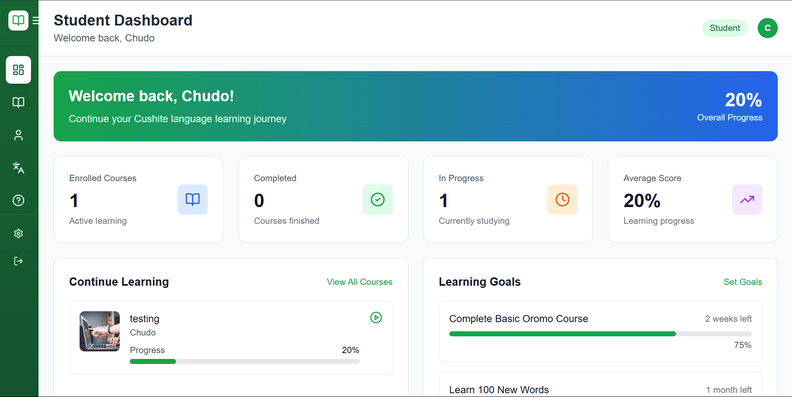
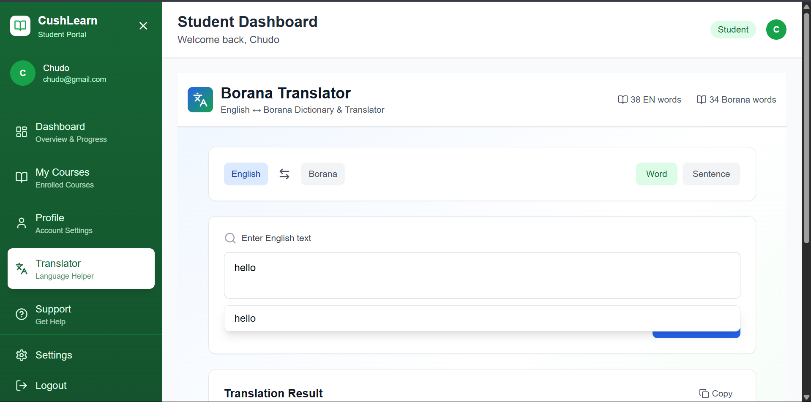
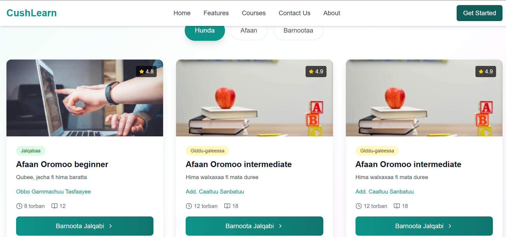

# CushLearn - Multilingual Education Platform

[](https://opensource.org/licenses/MIT)
[](https://nodejs.org)
[](https://reactjs.org)

> Breaking language barriers in education for Cushitic communities through accessible, multilingual learning powered by AI translation.


## 🌟 Overview

CushLearn is a comprehensive educational platform designed to bridge the language gap for Cushitic language communities (Oromo, Somali, Borana). The platform provides multilingual course content, real-time translation tools, and an intuitive learning management system that works both online and offline.

### Key Features

- 🌍 **Multilingual Support** - Seamless learning in Oromo, Somali, Borana, and English
- 🤖 **AI-Powered Translation** - Real-time English ↔ Borana/Oromo translation tool
- 📱 **Offline Functionality** - Access educational content without internet connectivity
- 👨‍🎓 **Dual Dashboards** - Separate interfaces for students and administrators
- 📊 **Progress Tracking** - Comprehensive analytics and learning metrics
- 💬 **Support System** - Built-in messaging for student-admin communication
- 🎥 **Video Integration** - YouTube-integrated course content with playlist support

## 🚀 Live Demo

- **Frontend**: [https://cushlearn.vercel.app](https://cush-learn.onrender.com/)
- **Backend API**: [https://cush-learn-node.onrender.com](https://cush-learn-node.onrender.com)
- **Translation Service**: [https://ed-platform.onrender.com](https://ed-platform.onrender.com)

### Demo Credentials

**Admin Access:**
- Email: `admin@cushite.com`
- Password: `admin123456`

**Student Access:**
- Register a new account or use the admin panel to create test accounts

## 🛠️ Tech Stack

### Frontend
- **React 18** - UI framework
- **Tailwind CSS** - Styling
- **React Router** - Navigation
- **Lucide React** - Icon library
- **Axios** - HTTP client

### Backend
- **Node.js** - Runtime environment
- **Express.js** - Web framework
- **MongoDB** - Database
- **JWT** - Authentication
- **Bcrypt** - Password hashing

### Translation Service
- **Python Flask** - Translation API
- **Custom Dictionary** - Borana/Oromo translations

## 📋 Prerequisites

Before you begin, ensure you have the following installed:
- Node.js (v16 or higher)
- MongoDB (v4.4 or higher)
- Python 3.8+ (for translation service)
- npm or yarn

## 💻 Installation & Setup

### 1. Clone the Repository

```bash
git clone https://github.com/Nasibodula/ED-Platform.git
cd cushlearn
```

### 2. Backend Setup

```bash
cd server
npm install
```

Create a `.env` file in the server directory:

```env
PORT=5000
MONGODB_URI=mongodb://localhost:27017/cushlearn
JWT_SECRET=your_super_secret_jwt_key_here_change_this
NODE_ENV=development
```

Start the backend server:

```bash
npm run dev
```

### 3. Frontend Setup

```bash
cd client
npm install
```

Create a `.env` file in the client directory:

```env
REACT_APP_API_URL=http://localhost:5000/api
```

Start the frontend development server:

```bash
npm start
```

### 4. Translation Service Setup (Optional)

The translation service is hosted separately. To run it locally:

```bash
cd translation-service
pip install -r requirements.txt
python app.py
```

## 🎯 Project Structure

```
cushlearn/
├── client/                 # React frontend
│   ├── public/
│   ├── src/
│   │   ├── components/    # Reusable components
│   │   │   ├── Auth/      # Authentication components
│   │   │   └── Homepage/  # Landing page components
│   │   ├── pages/         # Page components
│   │   │   ├── AdminDashboard/
│   │   │   ├── StudentDashboard/
│   │   │   └── Landingpage/
│   │   ├── contexts/      # React contexts
│   │   ├── utils/         # Utility functions & API
│   │   └── data/          # Static data (courses)
│   └── package.json
│
├── server/                # Node.js backend
│   ├── controllers/       # Route controllers
│   ├── models/           # MongoDB models
│   ├── routes/           # API routes
│   ├── middleware/       # Custom middleware
│   └── server.js         # Entry point
│
└── README.md
```

## 🔑 Key Features Breakdown

### For Students

- **Course Enrollment** - Browse and enroll in multilingual courses
- **Progress Tracking** - Monitor learning progress with detailed analytics
- **Translation Tool** - Access real-time English-Borana translation
- **Support System** - Submit course requests and get help
- **Profile Management** - Customize learning preferences

### For Administrators

- **Dashboard Analytics** - Monitor platform-wide statistics
- **Course Management** - Create, edit, and publish courses
- **Student Management** - View and manage student accounts
- **Message Center** - Respond to student inquiries and requests
- **Activity Monitoring** - Track recent platform activities

### Translation Features

- **Word Translation** - Individual word lookup with autocomplete
- **Sentence Translation** - Full sentence translation capability
- **Bidirectional** - English ↔ Borana/Oromo translation
- **Suggestions** - Smart suggestions for misspelled words
- **Dictionary Stats** - Live dictionary size statistics

## 🎨 Screenshots

### Landing Page


### Student Dashboard


### Translation Tool


### Course Catalog


## 🌐 API Endpoints

### Authentication
```
POST   /api/auth/register     - Register new student
POST   /api/auth/login        - Login user
GET    /api/auth/me           - Get current user
```

### Courses
```
GET    /api/courses           - Get all published courses
GET    /api/courses/:id       - Get course details
POST   /api/courses           - Create course (Admin)
PUT    /api/courses/:id       - Update course (Admin)
DELETE /api/courses/:id       - Delete course (Admin)
POST   /api/courses/:id/enroll - Enroll in course
```

### Students
```
GET    /api/student/enrolled-courses  - Get enrolled courses
GET    /api/student/stats             - Get student statistics
PUT    /api/student/courses/:id/progress - Update progress
```

### Messages
```
POST   /api/messages          - Create support message
GET    /api/messages/my       - Get student messages
GET    /api/messages          - Get all messages (Admin)
PUT    /api/messages/:id/respond - Respond to message (Admin)
```

### Translation
```
POST   /api/translate         - Translate text
GET    /api/suggestions       - Get word suggestions
GET    /api/dictionary        - Get dictionary stats
```

## 🧪 Testing

### Running Tests

```bash
# Backend tests
cd server
npm test

# Frontend tests
cd client
npm test
```

## 🚢 Deployment

### Frontend (Vercel)

1. Connect your GitHub repository to Vercel
2. Set environment variables in Vercel dashboard
3. Deploy with automatic CI/CD

### Backend (Render)

1. Create a new Web Service on Render
2. Connect your GitHub repository
3. Set environment variables
4. Deploy with automatic builds

### Database (MongoDB Atlas)

1. Create a MongoDB Atlas cluster
2. Whitelist IP addresses
3. Update connection string in environment variables

## 🤝 Contributing

Contributions are welcome! Please follow these steps:

1. Fork the repository
2. Create a feature branch (`git checkout -b feature/AmazingFeature`)
3. Commit your changes (`git commit -m 'Add some AmazingFeature'`)
4. Push to the branch (`git push origin feature/AmazingFeature`)
5. Open a Pull Request

## 📝 Code Style

- Follow ESLint configuration for JavaScript
- Use Prettier for code formatting
- Write meaningful commit messages
- Add comments for complex logic

## 🐛 Known Issues

- Translation API may have limited vocabulary coverage
- Offline mode requires prior content download
- Some YouTube videos may not load in certain regions

## 🗺️ Roadmap

- [ ] Mobile app development (React Native)
- [ ] WhatsApp integration for course delivery
- [ ] Expanded language support (Afar, other Cushitic languages)
- [ ] AI-powered course recommendations
- [ ] Certificate generation system
- [ ] Payment gateway integration
- [ ] Advanced analytics dashboard
- [ ] Community forums

## 📄 License

This project is licensed under the MIT License - see the [LICENSE](LICENSE) file for details.

## 👥 Authors

**Your Name**
- GitHub: [@nasibodula](https://github.com/Nasibodula)
- LinkedIn: [Nasibo Dula Chudo](https://www.linkedin.com/in/nasibo-dula-chudo-8a1296241)
- Email: nasibochudo@gmail.com

## 🙏 Acknowledgments

- Cushitic language communities for feedback
- Open source libraries and frameworks used
- YouTube creators for educational content

## 📞 Support

For support, email nasibochudo@gmail.com or reach out on linkedin https://www.linkedin.com/in/nasibo-dula-chudo-8a1296241.

## ⭐ Show Your Support

Give a ⭐️ if this project helped you or you find it interesting!

---

**Built with ❤️ for Less Privileged community**